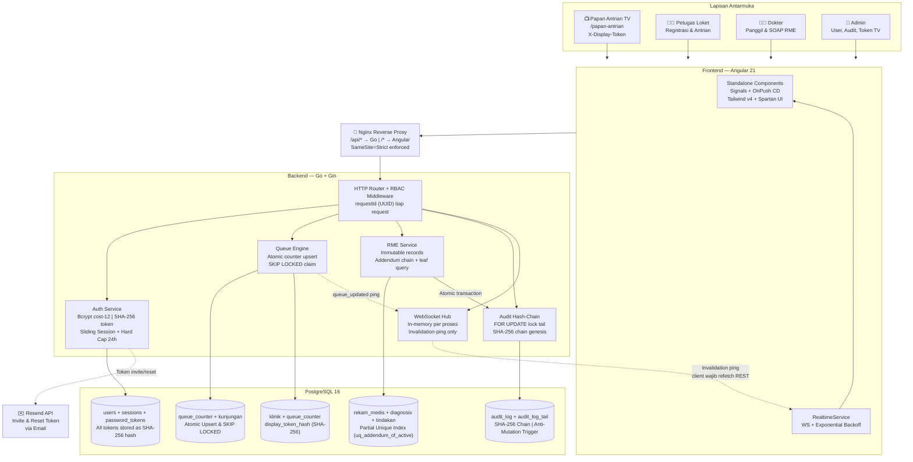
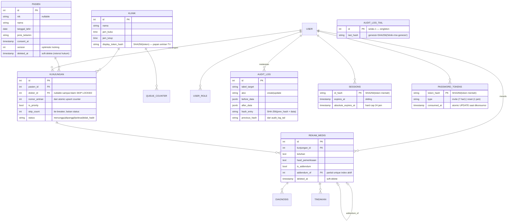
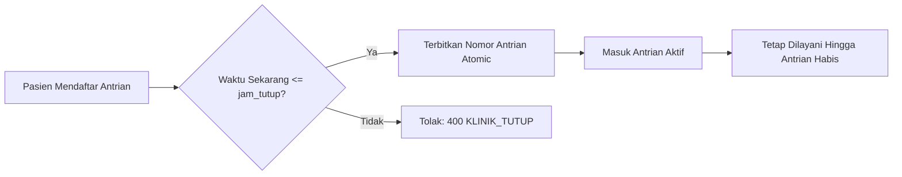
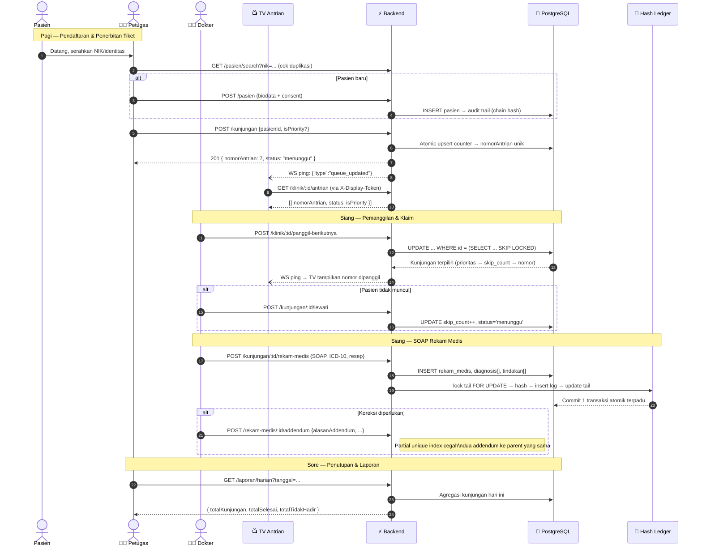

<div align="center">

# 🏥 Klinik RME & Antrian Real-Time

**Sistem Rekam Medis Elektronik internal & manajemen antrian multi-dokter dengan kontrol konkurensi ketat, jejak audit kriptografis tamper-evident, dan skema data selaras SATUSEHAT.**

[](https://github.com/danisetiawan31/klinik-rme/actions)
[](https://go.dev/)
[](https://angular.dev/)
[](https://www.postgresql.org/)
[](https://tailwindcss.com/)
[](https://vitest.dev/)
[](https://playwright.dev/)
[](LICENSE)

> 📋 Seluruh data demo/testing di repository ini adalah data **fiktif/sintetis** — bukan data pasien asli.

</div>

---

## 🎯 Konteks & Motivasi

Surat Edaran Bersama (BPJS Kesehatan, Kemenkes, Kemendagri, KPK, BSSN — 30 Juli 2026) mendorong transisi ke klaim elektronik berbasis RME yang terhubung SATUSEHAT, dengan *enforcement* penuh ("No RME, No Claim") ditargetkan nasional pada 2027. Masalah operasional klinik kecil sudah nyata hari ini:

| Masalah Operasional | Dampak Nyata | Solusi di Sistem Ini |
| :--- | :--- | :--- |
| Nomor antrian tulis manual atau via Excel | Duplikasi nomor saat lonjakan pasien pagi | Atomic counter `ON CONFLICT DO UPDATE` |
| Dua dokter memanggil pasien yang sama | Konflik & kebingungan di ruang tunggu | `FOR UPDATE SKIP LOCKED` — klaim tanpa blok |
| Rekam medis diedit langsung di berkas | Tidak ada bukti koreksi, risiko hukum | Immutable + wajib addendum berantai |
| Audit log bisa dihapus/dimanipulasi admin DB | Tidak dapat dipercaya untuk kebutuhan regulasi | SHA-256 hash-chain + DB trigger anti-mutasi |
| Layar TV antrian pakai akun staff | Token kadaluarsa → TV mati di tengah operasional | Display token terpisah, long-lived, per-klinik |

**Scope:** Sistem internal 1 klinik (bukan integrasi resmi SATUSEHAT — butuh akses API Kemenkes). Skema data selaras konsep SATUSEHAT: siap upgrade jika integrasi dibuka.

---

## 🏛️ Arsitektur Sistem



---

## 🗄️ Entity Relationship Diagram



---

## ⚡ Pola Konkurensi & Integritas Data Kritis

Empat pola locking yang sengaja dipilih dan wajib dipahami sebelum memodifikasi kode core:

### 1️⃣ Nomor Antrian — Atomic Upsert Counter
```sql
-- ❌ DILARANG: SELECT COUNT(*) + INSERT — race condition saat bersamaan
-- ✅ BENAR: Atomic upsert, nomor tidak pernah dobel
INSERT INTO queue_counter (klinik_id, tanggal, last_number)
VALUES ($1, CURRENT_DATE, 1)
ON CONFLICT (klinik_id, tanggal)
DO UPDATE SET last_number = queue_counter.last_number + 1
RETURNING last_number;
```

### 2️⃣ Klaim Antrian Dokter — SKIP LOCKED (Non-Blocking)
```sql
-- Dua dokter bisa klaim pasien berbeda secara paralel tanpa saling tunggu
-- Prioritas: is_priority DESC → skip_count ASC → nomor_antrian ASC
UPDATE kunjungan SET status = 'dipanggil', dokter_id = $1, dipanggil_at = now()
WHERE id = (
  SELECT id FROM kunjungan
  WHERE klinik_id = $2 AND tanggal_kunjungan = CURRENT_DATE AND status = 'menunggu'
  ORDER BY is_priority DESC, skip_count ASC, nomor_antrian ASC
  LIMIT 1
  FOR UPDATE SKIP LOCKED   -- ← bukan FOR UPDATE biasa, tidak memblokir dokter lain
) RETURNING *;
```

### 3️⃣ Audit Hash-Chain — FOR UPDATE Sequential (Blocking)
```sql
-- Bukan SKIP LOCKED — chain harus sekuensial ketat, tidak boleh lompat
-- Satu transaksi atomik: [write bisnis] + [lock tail] + [insert log] + [update tail]
BEGIN;
  -- write data bisnis (rekam_medis / pasien) ...
  SELECT last_hash FROM audit_log_tail WHERE id = 1 FOR UPDATE;
  INSERT INTO audit_log (..., previous_hash, hash_entry) VALUES (..., $last_hash, $new_hash);
  UPDATE audit_log_tail SET last_hash = $new_hash WHERE id = 1;
COMMIT;
```

### 4️⃣ Versi Terkini Rekam Medis — Leaf Traverse Query
```sql
-- Bukan flag is_latest (bisa de-sync) — cari yang tidak punya penerus aktif
SELECT r.* FROM rekam_medis r
WHERE r.kunjungan_id = $1
  AND r.deleted_at IS NULL
  AND NOT EXISTS (
    SELECT 1 FROM rekam_medis r2
    WHERE r2.addendum_of = r.id AND r2.deleted_at IS NULL  -- tidak ada yang menunjuk ke r
  )
ORDER BY r.created_at DESC LIMIT 1;

-- DB juga menjaga integritas via partial unique index:
-- CREATE UNIQUE INDEX uq_addendum_of_active ON rekam_medis (addendum_of) WHERE deleted_at IS NULL;
```

---

## 🏥 Penyelarasan Konseptual SATUSEHAT (FHIR Alignment)

Walaupun aplikasi ini bekerja sebagai sistem internal mandiri (*standalone*), skema basis data dirancang selaras dengan standar **HL7 FHIR Release 4** yang menjadi fondasi platform SATUSEHAT Kemenkes RI:

| Entitas Internal Klinik | Resource FHIR Target | Pemetaan Atribut Kunci | Catatan Interoperabilitas |
| :--- | :--- | :--- | :--- |
| `pasien` | `Patient` | `nik` → `identifier: NIK`, `nama`, `tanggal_lahir`, `jenis_kelamin`, `alamat`, `consent_at` | Format identitas NIK tervalidasi 16 digit; consent tercatat eksplisit |
| `kunjungan` | `Encounter` | `nomor_antrian`, `tanggal_kunjungan`, `status: AMB`, `dokter_id` → `participant` | Pelacakan status alur rawat jalan (*ambulatory care*) |
| `rekam_medis` | `ClinicalImpression` / `Observation` | `keluhan` (Subjective/Anamnesis), `hasil_pemeriksaan` (Objective/Tanda Vital) | Format pencatatan terstruktur standar SOAP dokter |
| `diagnosis` | `Condition` | `kode_icd` → `code: ICD-10`, `deskripsi` | Kodifikasi standar klasifikasi penyakit internasional |
| `tindakan` | `Procedure` / `MedicationRequest` | `jenis='tindakan'` → `Procedure`, `jenis='resep'` → `MedicationRequest` | Pemisahan resep obat dan tindakan medis per kunjungan |
| `audit_log` | `AuditEvent` | `actor_user_id` → `agent`, `tabel_target` → `entity`, `hash_entry` → `security label` | Jejak rekam aktivitas medis anti-manipulasi |

---

## 🛡️ Observabilitas & Sanitasi Error (Zero Data Leakage)

Untuk melindungi privasi data medis pasien (NIK, riwayat penyakit) dari kebocoran yang tidak disengaja lewat response HTTP atau pesan error:

```
┌─────────────────────────────────────────────────────────────────────────────┐
│  Standardized Error Envelope                                                │
├─────────────────────────────────────────────────────────────────────────────┤
│  {                                                                          │
│    "error": {                                                               │
│      "code": "NIK_DUPLICATE",                                               │
│      "message": "NIK sudah terdaftar dalam sistem",                         │
│      "requestId": "550e8400-e29b-41d4-a716-446655440000"                    │
│    }                                                                        │
│  }                                                                          │
└─────────────────────────────────────────────────────────────────────────────┘
```

- **Pesan Bersih untuk Client**: `message` dikurasi per `code` bisnis. Raw error basis data (seperti pesan constraint violation PostgreSQL yang berpotensi memuat string NIK/nama) **dilarang nembus ke client**.
- **Pelacakan via `requestId` (UUID)**: Setiap request HTTP diberi `requestId` unik. Jika terjadi insiden/bug, detail lengkap (raw DB error, stack trace, metadata) dicatat di server log bersama `requestId` tersebut. Tim support/developer cukup melakukan `grep <requestId>` di log server tanpa mengekspos data sensitif ke publik.

---

## ⏰ Kontrol Jam Operasional Klinik



1. **Aturan Bisnis Jam Tutup**: `POST /kunjungan` secara otomatis menolak pendaftaran baru jika jam server lokal (`Asia/Jakarta`) telah melewati `jam_tutup` klinik.
2. **Kelanjutan Pelayanan**: Pasien yang telah berhasil mendapatkan nomor antrian sebelum jam tutup **tetap dilayani oleh dokter** hingga seluruh antrian hari itu tuntas (*status selesai*).
3. **Indikator Real-Time di Frontend**: Header aplikasi menampilkan status operasional klinik (`ClinicStatusIndicatorComponent` — Buka/Tutup) dan tombol registrasi antrian dinonaktifkan secara proaktif saat klinik tutup.

---

## 🔄 Alur Operasional Harian



---

## 👥 Matriks Hak Akses (RBAC)

> **Aturan penting:** `admin` dan `dokter` bersifat **mutually exclusive** — 1 akun tidak boleh merangkap keduanya. Tujuan: mencegah admin mengakses data klinis secara insidental melalui endpoint sehari-hari.

| Endpoint / Fitur | `petugas` | `dokter` | `admin` | Display TV |
| :--- | :---: | :---: | :---: | :---: |
| `POST /auth/login`, `GET /auth/me` | ✅ | ✅ | ✅ | ❌ |
| `POST /pasien` — Registrasi pasien baru | ✅ | ❌ | ✅ | ❌ |
| `GET /pasien/search` — Cari pasien | ✅ | ✅ | ✅ | ❌ |
| `PATCH /pasien/:id` — Edit biodata | ✅ | ❌ | ✅ | ❌ |
| `POST /kunjungan` — Daftar antrian | ✅ | ❌ | ✅ | ❌ |
| `GET /klinik/:id/antrian` — Lihat antrian | ✅ (full) | ✅ (full) | ✅ (full) | ✅ (tanpa nama pasien) |
| `POST /klinik/:id/panggil-berikutnya` | ❌ | ✅ | ❌ | ❌ |
| `POST /kunjungan/:id/lewati` | ❌ | ✅ | ❌ | ❌ |
| `POST /kunjungan/:id/tidak-hadir` | ❌ | ✅ | ✅ | ❌ |
| `POST /kunjungan/:id/rekam-medis` | ❌ | ✅ | ❌ | ❌ |
| `GET /kunjungan/:id/rekam-medis` | ❌ | ✅ | ❌ | ❌ |
| `POST /rekam-medis/:id/addendum` | ❌ | ✅ | ❌ | ❌ |
| `GET /laporan/harian` | ✅ | ✅ | ✅ | ❌ |
| `GET /admin/audit-log` | ❌ | ❌ | ✅ | ❌ |
| `GET /admin/users`, `POST /admin/users` | ❌ | ❌ | ✅ | ❌ |
| `POST /admin/klinik/:id/display-token/regenerate` | ❌ | ❌ | ✅ | ❌ |

---

## 🔐 Model Keamanan & Token

```
┌─────────────────────────────────────────────────────────────────────────────┐
│  Token Storage Rules — "DB tidak pernah menyimpan token mentah"             │
├──────────────────┬──────────────────┬───────────────────────────────────────┤
│ Jenis Token      │ Disimpan di DB   │ Token Mentah Ada Di...                │
├──────────────────┼──────────────────┼───────────────────────────────────────┤
│ Session staff    │ SHA256(token)    │ Cookie httpOnly (tidak bisa dibaca JS) │
│ Invite user      │ SHA256(token)    │ Email link + response admin (1 kali)  │
│ Reset password   │ SHA256(token)    │ Email link SAJA (tidak pernah di API) │
│ Display token TV │ SHA256(token)    │ Response admin saat regenerate (1×)   │
└──────────────────┴──────────────────┴───────────────────────────────────────┘

Cookie: httpOnly + Secure + SameSite=Strict
Session: Sliding expiry + absolute_expires_at 24 jam (hard cap)
Password: Bcrypt cost 12 | Random token: crypto/rand 128-bit entropy base64url
```

**Anti-User-Enumeration:** `POST /auth/forgot-password` selalu return `200` generik, terlepas email terdaftar atau tidak. Token reset **tidak pernah** dikembalikan di response — hanya dikirim ke inbox email.

---

## 📡 API Endpoints Lengkap

<details>
<summary><strong>Auth (/auth/*)</strong></summary>

| Method | Path | Role | Deskripsi |
| --- | --- | --- | --- |
| `POST` | `/auth/login` | public | Login → set cookie session |
| `POST` | `/auth/logout` | authenticated | Logout → clear cookie |
| `GET` | `/auth/me` | authenticated | Cek identitas & roles aktif |
| `PATCH` | `/auth/me/password` | authenticated | Ganti password mandiri |
| `POST` | `/auth/forgot-password` | public | Request reset (selalu 200 generik) |
| `POST` | `/auth/reset-password` | public | Konsumsi token reset → set password baru |

</details>

<details>
<summary><strong>Pasien & Kunjungan</strong></summary>

| Method | Path | Role | Deskripsi |
| --- | --- | --- | --- |
| `POST` | `/pasien` | petugas, admin | Registrasi pasien baru + consent |
| `GET` | `/pasien/search?nik=&nama=&page=&limit=` | petugas, dokter, admin | Cari pasien (NIK atau nama parsial, atau keduanya) |
| `GET` | `/pasien/:id` | petugas, dokter, admin | Detail biodata + riwayat kunjungan ringkas |
| `PATCH` | `/pasien/:id` | petugas, admin | Edit biodata (optimistic lock via `version`) |
| `POST` | `/kunjungan` | petugas, admin | Daftar antrian baru (atomic counter) |
| `GET` | `/kunjungan/:id` | petugas, dokter, admin | Detail kunjungan |
| `GET` | `/klinik/:id/antrian` | staff + display token | Daftar antrian aktif (response berbeda per channel auth) |
| `POST` | `/klinik/:id/panggil-berikutnya` | dokter | Klaim SKIP LOCKED + broadcast WS |
| `POST` | `/kunjungan/:id/lewati` | dokter | Skip → skip_count++ → kembali ke antrian |
| `POST` | `/kunjungan/:id/tidak-hadir` | dokter, admin | Tandai final tidak hadir |

</details>

<details>
<summary><strong>Rekam Medis</strong></summary>

| Method | Path | Role | Deskripsi |
| --- | --- | --- | --- |
| `POST` | `/kunjungan/:id/rekam-medis` | dokter | Catat RME SOAP + ICD-10 + tindakan/resep |
| `POST` | `/rekam-medis/:id/addendum` | dokter | Koreksi via addendum berantai (bukan edit langsung) |
| `GET` | `/kunjungan/:id/rekam-medis` | dokter | Versi terkini saja (leaf query) |
| `GET` | `/pasien/:id/riwayat` | dokter | Riwayat kunjungan + RME terkini per kunjungan |

</details>

<details>
<summary><strong>Admin & Laporan</strong></summary>

| Method | Path | Role | Deskripsi |
| --- | --- | --- | --- |
| `GET` | `/admin/users?page=&limit=` | admin | Daftar pengguna staff |
| `POST` | `/admin/users` | admin | Undang user baru (tanpa password, via email invite) |
| `POST` | `/admin/users/:id/resend-invite` | admin | Kirim ulang email undangan |
| `PATCH` | `/admin/users/:id` | admin | Koreksi nama/email user |
| `PATCH` | `/admin/users/:id/roles` | admin | Ubah peran (mutual exclusivity admin ≠ dokter) |
| `GET` | `/admin/audit-log?tabelTarget=&recordId=&actorId=&page=&limit=` | admin | Daftar entri audit (tanpa isi klinis) |
| `GET` | `/admin/audit-log/:id` | admin | Detail penuh (before/after data + hash) |
| `POST` | `/admin/klinik/:id/display-token/regenerate` | admin | Regenerate display token TV (invalidate lama) |
| `GET` | `/laporan/harian?tanggal=` | petugas, dokter, admin | Rekap operasional harian |
| `GET` | `/health` | public | Health check container/proxy |
| `WS` | `/ws?klinikId=X` | staff + display token | Invalidation ping → client wajib refetch |

</details>

---

## 🛠️ Tech Stack

```
┌─────────────────────────────────────────────────────────────────┐
│  FRONTEND                                                       │
├────────────────────┬────────────────────────────────────────────┤
│ Framework          │ Angular 21 (Standalone Components, Signals)│
│ Change Detection   │ OnPush (semua komponen)                    │
│ Styling            │ Tailwind CSS v4 + semantic @theme tokens   │
│ UI Primitives      │ Spartan UI (Headless CDK + Helm styled)    │
│ Icons & Toast      │ Lucide (@ng-icons) + Sonner               │
│ Realtime           │ Native WebSocket + exponential backoff     │
│ State              │ Angular Signals + RxJS untuk async stream  │
│ Unit Tests         │ Vitest — 44 test suites, 229 tests        │
│ E2E & Visual Tests │ Playwright — Chromium Headless Automation  │
└────────────────────┴────────────────────────────────────────────┘
┌─────────────────────────────────────────────────────────────────┐
│  BACKEND                                                        │
├────────────────────┬────────────────────────────────────────────┤
│ Language & Router  │ Go 1.23 + Gin Web Framework               │
│ DB Access Layer    │ sqlc (type-safe SQL codegen) + pgx/v5      │
│ Database           │ PostgreSQL 16 (triggers, partial indexes)  │
│ Migration          │ golang-migrate (auto-run saat server start)│
│ Realtime           │ Gorilla WebSocket (in-memory hub/proses)   │
│ Cryptography       │ SHA-256 chain + Bcrypt cost-12 + crypto/rand|
│ Email              │ Resend API (invite & reset password)       │
│ Integration Tests  │ testcontainers-go (real PostgreSQL)        │
└────────────────────┴────────────────────────────────────────────┘
┌─────────────────────────────────────────────────────────────────┐
│  DEPLOYMENT                                                     │
├────────────────────┬────────────────────────────────────────────┤
│ Containerization   │ Docker multi-stage (Go binary kecil)       │
│ Reverse Proxy      │ Nginx (/api/* → Go | /* → Angular static) │
│ Orchestration      │ docker-compose (1 command local dev/demo)  │
│ CI/CD              │ GitHub Actions (Go 1.23 + Node 22 LTS)     │
│ Hosting target     │ VPS kecil / Railway / Fly.io               │
└────────────────────┴────────────────────────────────────────────┘
```

---

## 🧪 Pengujian Otomatis

```
┌──────────────────────────────────────────────────────────────────────┐
│  Backend Integration Tests — Real PostgreSQL (testcontainers-go)     │
│  Menguji behavior yang HANYA bisa diverifikasi di DB asli:           │
│  • Atomic counter: goroutine konkuren, assert tidak ada nomor dobel  │
│  • SKIP LOCKED claim: dua dokter bersamaan, assert tidak ada overlap  │
│  • Hash-chain audit: urutan sekuensial, assert chain valid & intact  │
│  • Partial unique index: dua addendum ke parent sama, assert 409     │
│  • Migration runner: auto-run dari schema kosong, assert UP/DOWN     │
└──────────────────────────────────────────────────────────────────────┘
┌──────────────────────────────────────────────────────────────────────┐
│  Frontend Unit Tests — Vitest (44 suites, 229 tests)                 │
│  • Auth & routing: resolver, roleGuard, interceptor 401 handler      │
│  • Form validation: Reactive Forms, FormArray ICD-10, addendum       │
│  • WebSocket: reconnect backoff, Signal derivation dari event        │
│  • Admin: mutual exclusivity role, audit diff viewer, hash display   │
│  • Komponen: PaginationComponent, RevealOnceSecret, AuditDiffViewer  │
│  • Workspace: RekamMedisListComponent (hero call, search, tabs)      │
└──────────────────────────────────────────────────────────────────────┘
┌──────────────────────────────────────────────────────────────────────┐
│  Automated Headless E2E Browser Testing — Playwright (17 flows)      │
│  • Suite 1: Papan Antrian TV Publik (akses langsung tanpa login)     │
│  • Suite 2: Admin Full Lifecycle & Subtab Switching (users/audit/kl) │
│  • Suite 3: Cross-Module Navigation (Beranda, Antrian, Pasien, Lap)  │
│  • Suite 4: Dokter Clinical Workspace (/rekam-medis) & SOAP form     │
│  • Suite 5: Petugas Loket Reception & Role Isolation Enforcement     │
│  • Visual Snapshots: 14 tangkapan layar HD 1440x900 di ./screenshots │
└──────────────────────────────────────────────────────────────────────┘
```

```bash
# 1. Backend — jalankan semua test termasuk concurrency (butuh Docker aktif)
cd backend && go test -v -p 1 ./...

# 2. Frontend — semua unit test (229 tests, ~5 detik)
cd frontend && npx ng test --watch=false

# 3. Automated Headless E2E Browser Testing (Playwright)
node e2e-test.mjs

# 4. Frontend — production build verification (AOT)
cd frontend && npm run build
```

---

## 🚀 Quickstart Lokal

**Prasyarat:** Go 1.23+, Node.js 22 LTS, Docker (untuk PostgreSQL & testcontainers)

```bash
# 1. Clone repositori
git clone https://github.com/danisetiawan31/klinik-rme.git
cd klinik-rme

# 2. Backend — siapkan .env & jalankan server
cd backend
cp .env.example .env          # isi kredensial PostgreSQL & secret key
go run ./cmd/server           # migrasi DB otomatis berjalan saat startup
# ✅ Verifikasi: curl http://localhost:8080/health → {"status":"ok","db":"ok"}

# 3. Frontend — install & jalankan dev server
cd ../frontend
npm install
npm start
# ✅ Buka browser: http://localhost:4200
```

> Nginx reverse proxy memastikan cookie `SameSite=Strict` bekerja benar di production. Untuk dev lokal, Angular dev-server sudah dikonfigurasi `proxy.conf.json` (`/api/*` → `localhost:8080`) sehingga origin tetap sama.

---

## 📂 Struktur Repositori

```
klinik-rme/
├── .github/workflows/ci.yml   # CI: Go 1.23 (gofmt, vet, test) + Node 22 (Vitest, build)
├── AGENTS.md                  # Konvensi kode, data integrity rules, reporting format
├── docs/
│   ├── PRD.md                 # Latar belakang, scope, aktor, alur operasional
│   ├── TDD.md                 # Arsitektur, ERD, locking patterns, auth & deployment
│   ├── api-contract.md        # Spesifikasi lengkap endpoint (request/response/role/error)
│   └── DESIGN.md              # Component Registry & semantic design tokens (living doc)
├── workflow/
│   ├── backlog.md             # 19 backlog item — semua [x] Selesai Penuh
│   ├── done_be.md             # Log histori verifikasi Backend
│   └── done_fe.md             # Log histori verifikasi Frontend
├── backend/
│   ├── cmd/server/            # Entrypoint binary Go
│   ├── internal/
│   │   ├── api/               # HTTP handlers (per domain), router, RBAC middleware
│   │   ├── audit/             # Hash-chain ledger service (lock tail, chain, genesis)
│   │   ├── auth/              # SHA-256 hashing, session, bcrypt, token lifecycle
│   │   ├── bootstrap/         # Auto-seed admin pertama (idempotent, startup check)
│   │   ├── db/                # pgx pool + generated/ (sqlc output — JANGAN diedit manual)
│   │   ├── mailer/            # Integrasi Resend API
│   │   └── realtime/          # In-memory WebSocket hub + dispatcher
│   ├── migrations/            # File DDL SQL migrasi (golang-migrate)
│   └── queries/               # Raw SQL yang dicompile sqlc → internal/db/generated/
└── frontend/
    └── src/app/
        ├── core/              # AuthService, RealtimeService (WS+backoff), Guards, Interceptors
        ├── features/          # Pasien, Antrian, Rekam Medis, Admin, Papan Antrian, Laporan
        └── shared/            # PaginationComponent, RevealOnceSecret, AuditDiffViewer, Badges
```

---

## 📝 Di Luar Scope MVP

| Item | Alasan Dikecualikan |
| :--- | :--- |
| Integrasi resmi SATUSEHAT | Butuh akses API Kemenkes — di luar jangkauan |
| Digital signature per-dokter | Disederhanakan ke hash-chain record integrity |
| Pembayaran / billing / klaim BPJS | Modul terpisah, bukan scope RME internal |
| Multi-poli / rujukan antar-faskes | Skala single klinik 1 alur pemeriksaan |
| Offline handling / reliability | Tidak masuk target deployment saat ini |

---

<div align="center">

Didesain & dikembangkan dengan standar rekayasa presisi tinggi oleh **Ahmad Dhani Setiawan**

[](LICENSE)

</div>
